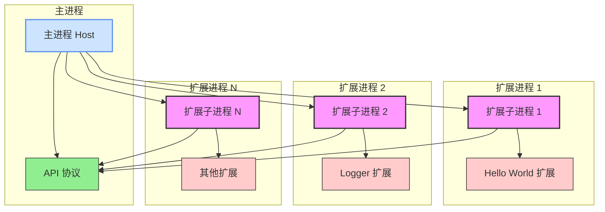

# VS Code 扩展宿主模拟器架构图

## 组件说明

### 主进程 (Host Process)
- 负责发现和管理所有扩展
- 处理扩展间的通信
- 路由命令到指定扩展
- 广播事件给所有扩展

### 扩展子进程 (Extension Worker Process)
- 每个扩展在独立的子进程中运行
- 提供进程级隔离
- 注入最小化的 VS Code API
- 处理扩展的生命周期

### API 协议 (API Protocol)
- 定义主进程与扩展进程间的通信协议
- 包含所有支持的消息类型

### 扩展 (Extensions)
- 独立的 VS Code 扩展实现
- 在各自的子进程中运行
- 通过 API 协议与主进程通信