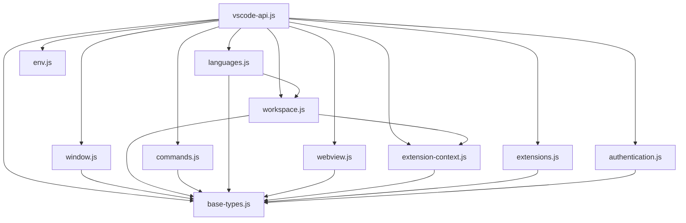

# VSCode Shim 模块依赖关系

本文档详细描述了VSCode Shim模块化实现中各模块之间的依赖关系。

## 模块依赖图



## 模块依赖关系详解

### vscode-api.js（主入口文件）
这是整个模块化实现的入口点，它导入并组装所有其他模块，提供完整的VSCode API。

**依赖：** 所有其他模块

### base-types.js（基础类型和常量）
包含所有基础类型和常量，是其他多个模块的基础依赖。

**被依赖：**
- window.js
- workspace.js
- commands.js
- languages.js
- webview.js
- extension-context.js
- authentication.js
- extensions.js

### window.js（vscode.window 模块）
实现VSCode窗口相关功能。

**依赖：**
- base-types.js

### workspace.js（vscode.workspace 模块）
实现VSCode工作空间相关功能。

**依赖：**
- base-types.js
- extension-context.js（通过window.js间接依赖）

### commands.js（vscode.commands 模块）
实现VSCode命令相关功能。

**依赖：**
- base-types.js
- window.js
- workspace.js

### languages.js（vscode.languages 模块）
实现VSCode语言相关功能。

**依赖：**
- base-types.js
- workspace.js

### env.js（vscode.env 模块）
实现VSCode环境相关功能。

**依赖：**
- base-types.js

### extensions.js（vscode.extensions 模块）
实现VSCode扩展相关功能。

**依赖：**
- base-types.js

### authentication.js（vscode.authentication 模块）
实现VSCode认证相关功能。

**依赖：**
- base-types.js

### webview.js（vscode.webview 模块）
实现VSCode Webview相关功能。

**依赖：**
- base-types.js

### extension-context.js（ExtensionContext 相关）
实现VSCode扩展上下文相关功能。

**依赖：**
- base-types.js

## 依赖关系设计原则

1. **单向依赖**：模块间的依赖关系是单向的，避免循环依赖。
2. **基础模块优先**：base-types.js作为基础模块，被多个其他模块依赖。
3. **功能模块独立**：每个功能模块（如window.js、workspace.js等）尽可能独立，减少不必要的依赖。
4. **主入口统一**：vscode-api.js作为主入口，统一管理所有模块的导入和组装。

## 依赖关系优势

1. **清晰的层次结构**：模块间的依赖关系清晰，易于理解和维护。
2. **低耦合**：模块间的依赖关系最小化，降低了耦合度。
3. **高内聚**：每个模块的功能高度内聚，职责明确。
4. **可扩展性**：可以轻松添加新模块或修改现有模块，而不影响其他模块。
5. **可测试性**：模块间的依赖关系明确，便于进行单元测试。

## 模块导入导出机制

每个模块都遵循统一的导入导出格式：

```javascript
// 导入依赖
const baseTypes = require('./base-types');
// 其他依赖...

// 导出模块功能
module.exports = {
  // 类
  ClassName,
  
  // 对象
  objectName,
  
  // 常量
  CONSTANT_NAME
};
```

主入口文件vscode-api.js负责导入所有模块并组装成完整的VSCode API：

```javascript
// 导入所有模块
const baseTypes = require('./modules/base-types');
const window = require('./modules/window');
// 其他模块...

// 组装完整的VSCode API
module.exports = function createVscodeApi({ log, registerCommand }) {
  return {
    ...baseTypes,
    ...window,
    // 其他模块...
  };
};
```

这种导入导出机制确保了模块间的清晰依赖关系，同时提供了灵活的API组装方式。