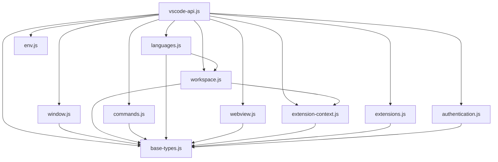

# VSCode Shim 模块拆分实施计划

## 1. 架构设计方案概述

基于对 `vscode-shim.js` 代码的详细分析，我们将原本的单一文件拆分为以下10个功能模块：

### 1.1 模块划分

1. **base-types.js** - 基础类型和常量
2. **window.js** - vscode.window 模块
3. **workspace.js** - vscode.workspace 模块
4. **commands.js** - vscode.commands 模块
5. **languages.js** - vscode.languages 模块
6. **env.js** - vscode.env 模块
7. **extensions.js** - vscode.extensions 模块
8. **authentication.js** - vscode.authentication 模块
9. **webview.js** - vscode.webview 模块
10. **extension-context.js** - ExtensionContext 相关

### 1.2 模块依赖关系



## 2. 详细模块设计

### 2.1 base-types.js 模块

**包含内容：**
- VSCodeEventEmitter 类
- Uri、Position、Range、Selection 类
- ThemeIcon、CodeAction 类
- 基础常量：FileType、DiagnosticSeverity、OverviewRulerLane、CodeActionKind
- Disposable、CancellationToken、CancellationTokenSource 类
- MarkdownString、TextEdit 类
- 枚举类型：ExtensionMode、UIKind、TextDocumentSaveReason、ConfigurationTarget、ProgressLocation、StatusBarAlignment

**导出格式：**
```javascript
module.exports = {
  // 类
  VSCodeEventEmitter,
  Uri,
  Position,
  Range,
  Selection,
  ThemeIcon,
  CodeAction,
  Disposable,
  CancellationToken,
  CancellationTokenSource,
  MarkdownString,
  TextEdit,
  
  // 常量
  FileType,
  DiagnosticSeverity,
  OverviewRulerLane,
  CodeActionKind,
  ExtensionMode,
  UIKind,
  TextDocumentSaveReason,
  ConfigurationTarget,
  ProgressLocation,
  StatusBarAlignment
};
```

### 2.2 window.js 模块

**包含内容：**
- TextEditor、TextDocument 类
- Tab、TabGroup、TabGroups 类
- window 对象及其所有方法
- ViewColumn 常量

**依赖：** base-types.js

**导出格式：**
```javascript
const baseTypes = require('./base-types');

module.exports = {
  // 类
  TextEditor,
  TextDocument,
  Tab,
  TabGroup,
  TabGroups,
  
  // window 对象
  window: { /* window 对象实现 */ },
  
  // 常量
  ViewColumn
};
```

### 2.3 workspace.js 模块

**包含内容：**
- WorkspaceEdit 类
- TextDocumentContentProvider 类
- ConfigurationChangeEvent、WorkspaceFoldersChangeEvent 类
- WorkspaceConfiguration 类
- workspace 对象及其所有方法

**依赖：** base-types.js, extension-context.js

**导出格式：**
```javascript
const baseTypes = require('./base-types');
const { ExtensionContext } = require('./extension-context');

module.exports = {
  // 类
  WorkspaceEdit,
  TextDocumentContentProvider,
  ConfigurationChangeEvent,
  WorkspaceFoldersChangeEvent,
  WorkspaceConfiguration,
  
  // workspace 对象
  workspace: { /* workspace 对象实现 */ }
};
```

### 2.4 commands.js 模块

**包含内容：**
- CommandManager 类
- commands 对象及其所有方法
- 内置命令实现

**依赖：** base-types.js, window.js, workspace.js

**导出格式：**
```javascript
const baseTypes = require('./base-types');
const { window } = require('./window');
const { workspace } = require('./workspace');

module.exports = {
  // 类
  CommandManager,
  
  // commands 对象
  commands: { /* commands 对象实现 */ }
};
```

### 2.5 languages.js 模块

**包含内容：**
- 语言功能相关类型：Diagnostic、DiagnosticRelatedInformation、CompletionItem 等
- 语言功能提供者接口：CodeActionProvider、CompletionItemProvider 等
- LanguageFeatureManager 类
- languages 对象及其所有方法

**依赖：** base-types.js, workspace.js

**导出格式：**
```javascript
const baseTypes = require('./base-types');
const { workspace } = require('./workspace');

module.exports = {
  // 类
  Diagnostic,
  DiagnosticRelatedInformation,
  CompletionItem,
  CompletionItemKind,
  Hover,
  Location,
  CodeActionProvider,
  CompletionItemProvider,
  HoverProvider,
  DefinitionProvider,
  DocumentFormattingEditProvider,
  CodeLensProvider,
  LanguageFeatureManager,
  
  // languages 对象
  languages: { /* languages 对象实现 */ }
};
```

### 2.6 env.js 模块

**包含内容：**
- env 对象及其所有方法

**依赖：** base-types.js

**导出格式：**
```javascript
const baseTypes = require('./base-types');

module.exports = {
  // env 对象
  env: { /* env 对象实现 */ }
};
```

### 2.7 extensions.js 模块

**包含内容：**
- Extension 类
- extensions 对象及其所有方法

**依赖：** base-types.js

**导出格式：**
```javascript
const baseTypes = require('./base-types');

module.exports = {
  // 类
  Extension,
  
  // extensions 对象
  extensions: { /* extensions 对象实现 */ }
};
```

### 2.8 authentication.js 模块

**包含内容：**
- AuthenticationSession、AuthenticationProvider 类
- authentication 对象及其所有方法

**依赖：** base-types.js

**导出格式：**
```javascript
const baseTypes = require('./base-types');

module.exports = {
  // 类
  AuthenticationSession,
  AuthenticationProvider,
  
  // authentication 对象
  authentication: { /* authentication 对象实现 */ }
};
```

### 2.9 webview.js 模块

**包含内容：**
- WebviewPanel、WebviewOptions、WebviewPanelOptions 类
- Webview、WebviewPanelImpl、WebviewView 类
- webview 对象及其所有方法

**依赖：** base-types.js

**导出格式：**
```javascript
const baseTypes = require('./base-types');

module.exports = {
  // 类
  WebviewPanel,
  WebviewOptions,
  WebviewPanelOptions,
  Webview,
  WebviewPanelImpl,
  WebviewView,
  
  // webview 对象
  webview: { /* webview 对象实现 */ }
};
```

### 2.10 extension-context.js 模块

**包含内容：**
- Memento 类
- ExtensionContext 类
- ExtensionActivator 类

**依赖：** base-types.js

**导出格式：**
```javascript
const baseTypes = require('./base-types');

module.exports = {
  // 类
  Memento,
  ExtensionContext,
  ExtensionActivator,
  
  // 工厂函数
  createExtensionContext: function(extensionPath, extensionId) { /* 实现 */ }
};
```

### 2.11 vscode-api.js 主入口文件

**包含内容：**
- 导入所有模块
- 组装完整的VSCode API
- 提供与原vscode-shim.js相同的接口

**导出格式：**
```javascript
const baseTypes = require('./modules/base-types');
const window = require('./modules/window');
const workspace = require('./modules/workspace');
const commands = require('./modules/commands');
const languages = require('./modules/languages');
const env = require('./modules/env');
const extensions = require('./modules/extensions');
const authentication = require('./modules/authentication');
const webview = require('./modules/webview');
const { ExtensionActivator, createExtensionContext } = require('./modules/extension-context');

module.exports = function createVscodeApi({ log, registerCommand }) {
  // 创建扩展激活器实例
  const extensionActivator = new ExtensionActivator();
  
  // 如果提供了log函数，替换console方法
  if (log) {
    const originalConsoleError = console.error;
    const originalConsoleWarn = console.warn;
    const originalConsoleLog = console.log;
    
    console.error = (...args) => log('[ERROR]', ...args);
    console.warn = (...args) => log('[WARN]', ...args);
    console.log = (...args) => log('[INFO]', ...args);
  }
  
  // 如果提供了registerCommand函数，使用它来注册命令
  if (registerCommand) {
    const originalRegisterCommand = commands.commands.registerCommand;
    commands.commands.registerCommand = (id, handler) => {
      registerCommand(id, handler);
      return originalRegisterCommand(id, handler);
    };
  }

  return {
    ...baseTypes,
    ...window,
    ...workspace,
    ...commands,
    ...languages,
    ...env,
    ...extensions,
    ...authentication,
    ...webview,
    ExtensionContext,
    Memento,
    ExtensionActivator,
    extensionActivator,
    createExtensionContext
  };
};
```

## 3. 实施步骤

1. 创建worker/modules目录结构
2. 创建base-types.js模块
3. 创建window.js模块
4. 创建workspace.js模块
5. 创建commands.js模块
6. 创建languages.js模块
7. 创建env.js模块
8. 创建extensions.js模块
9. 创建authentication.js模块
10. 创建webview.js模块
11. 创建extension-context.js模块
12. 创建vscode-api.js主入口文件
13. 为每个模块添加适当的JSDoc注释
14. 验证拆分后的代码功能是否与原有功能一致
15. 更新相关引用文件以使用新的模块结构

## 4. 注意事项

1. **保持向后兼容性**：新的vscode-api.js必须提供与原vscode-shim.js完全相同的API接口
2. **模块间依赖**：确保模块间的依赖关系正确，避免循环依赖
3. **代码复用**：原vscode-extension-context.js中的Memento类应该被extension-context.js模块复用
4. **事件处理**：确保事件发射器在模块间正确传递
5. **错误处理**：保持原有的错误处理逻辑不变

## 5. 验证计划

1. **功能测试**：确保所有原有功能在拆分后仍然正常工作
2. **API兼容性测试**：验证新API与原API的兼容性
3. **性能测试**：确保模块化不会带来明显的性能开销
4. **集成测试**：测试与现有系统的集成是否正常

## 6. 目录结构

```
worker/
├── modules/
│   ├── base-types.js
│   ├── window.js
│   ├── workspace.js
│   ├── commands.js
│   ├── languages.js
│   ├── env.js
│   ├── extensions.js
│   ├── authentication.js
│   ├── webview.js
│   └── extension-context.js
├── vscode-api.js (新主入口文件)
├── vscode-shim.js (原文件，保留作为备份)
└── vscode-extension-context.js (现有文件)
```

这个实施计划详细描述了如何将vscode-shim.js拆分为多个模块，包括每个模块的内容、依赖关系和导出格式。按照这个计划实施，可以确保代码的可维护性和可扩展性，同时保持向后兼容性。